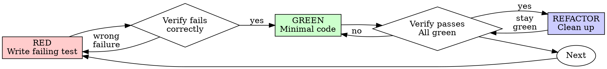

# Test-Driven Development (TDD)

## Overview

Write the test first. Watch it fail. Write minimal code to pass.

**Core principle:** If you didn't watch the test fail, you don't know if it tests the right thing.

## Applicability and preservation

`AGENTS.md` determines whether new tests are needed and which checks to run. Use this method for requested test-first work or a realistic regression not covered already. Documentation, visual-only changes, and existing adequate coverage do not need an exception request.

For new behavior, prefer a focused failing test before the fix. Preserve already-written implementation and unrelated work; never delete code or reset/revert the shared checkout merely to manufacture a red-green cycle. For an existing fix, review the test against the original failure and honestly report whether red behavior was observed. A safe, authorized isolated fixture can be used when negative-control evidence is necessary.

## Red-Green-Refactor



### RED - Write Failing Test

Write one minimal test showing what should happen.

<Good>
```typescript
test('retries failed operations 3 times', async () => {
  let attempts = 0;
  const operation = () => {
    attempts++;
    if (attempts < 3) throw new Error('fail');
    return 'success';
  };

  const result = await retryOperation(operation);

  expect(result).toBe('success');
  expect(attempts).toBe(3);
});
```
Clear name, tests real behavior, one thing
</Good>

<Bad>
```typescript
test('retry works', async () => {
  const mock = jest.fn()
    .mockRejectedValueOnce(new Error())
    .mockRejectedValueOnce(new Error())
    .mockResolvedValueOnce('success');
  await retryOperation(mock);
  expect(mock).toHaveBeenCalledTimes(3);
});
```
Vague name, tests mock not code
</Bad>

**Requirements:**
- One behavior
- Clear name
- Real code (no mocks unless unavoidable)

### Verify RED - Watch It Fail

For a new test-first change, establish the expected failure once; reuse that evidence while it remains valid.

```bash
npm test path/to/test.test.ts
```

Confirm:
- Test fails (not errors)
- Failure message is expected
- Fails because feature missing (not typos)

**Test already passes?** Check whether the behavior is already implemented or the test misses the failure. Do not break working code just to obtain a red result.

**Test errors?** Fix error, re-run until it fails correctly.

### GREEN - Minimal Code

Write simplest code to pass the test.

<Good>
```typescript
async function retryOperation<T>(fn: () => Promise<T>): Promise<T> {
  for (let i = 0; i < 3; i++) {
    try {
      return await fn();
    } catch (e) {
      if (i === 2) throw e;
    }
  }
  throw new Error('unreachable');
}
```
Just enough to pass
</Good>

<Bad>
```typescript
async function retryOperation<T>(
  fn: () => Promise<T>,
  options?: {
    maxRetries?: number;
    backoff?: 'linear' | 'exponential';
    onRetry?: (attempt: number) => void;
  }
): Promise<T> {
  // YAGNI
}
```
Over-engineered
</Bad>

Don't add features, refactor other code, or "improve" beyond the test.

### Verify GREEN - Watch It Pass

**MANDATORY.**

```bash
npm test path/to/test.test.ts
```

Confirm:
- Test passes
- Relevant existing coverage remains valid
- No new relevant errors; unrelated pre-existing warnings/failures are not cleanup tasks

**Test fails?** Fix code, not test.

**Other tests fail?** Investigate failures caused by this change or blocking it. Preserve and report unrelated pre-existing failures without broadening the task.

### REFACTOR - Clean Up

After green only:
- Remove duplication
- Improve names
- Extract helpers

Keep tests green. Don't add behavior.

### Repeat

Next failing test for next feature.

## Good Tests

| Quality | Good | Bad |
|---------|------|-----|
| **Minimal** | One thing. "and" in name? Split it. | `test('validates email and domain and whitespace')` |
| **Clear** | Name describes behavior | `test('test1')` |
| **Shows intent** | Demonstrates desired API | Obscures what code should do |

When writing or changing any test, read [writing-good-tests.md](writing-good-tests.md) for the rules that keep tests honest:
- Name the production change that would make the test fail — before writing it
- Assert on real behavior, never on mock behavior
- Keep test-only code in test utilities, out of production classes
- Understand a dependency's side effects before mocking it

## Evidence checks

Do not mistake a passing test for proof that it catches the original regression. Check the assertion, failure condition, and production path. Reuse valid automated or native/manual evidence for the claims it actually supports; neither kind proves unrelated behavior. Missing historical red evidence is a limitation to report, not permission to discard working code.

## Example: Bug Fix

**Bug:** Empty email accepted

**RED**
```typescript
test('rejects empty email', async () => {
  const result = await submitForm({ email: '' });
  expect(result.error).toBe('Email required');
});
```

**Verify RED**
```bash
$ npm test
FAIL: expected 'Email required', got undefined
```

**GREEN**
```typescript
function submitForm(data: FormData) {
  if (!data.email?.trim()) {
    return { error: 'Email required' };
  }
  // ...
}
```

**Verify GREEN**
```bash
$ npm test
PASS
```

**REFACTOR**
Extract validation for multiple fields if needed.

## Verification Checklist

Before marking work complete:

- [ ] Realistic changed behaviors have sufficient existing or new coverage
- [ ] For new test-first work, the observed failure is the intended regression, not a setup error
- [ ] Any unobserved red behavior is reported rather than invented
- [ ] Wrote minimal code to pass each test
- [ ] Selected targeted checks pass or limitations are reported
- [ ] No newly introduced relevant errors; unrelated warnings are left alone
- [ ] Tests use real code (mocks only if unavoidable)
- [ ] Edge cases and errors covered

Address material evidence gaps within scope. A checklist does not authorize extra tests, broader suites, or restarting completed work.

## When Stuck

| Problem | Solution |
|---------|----------|
| Don't know how to test | Write wished-for API. Write assertion first. Ask your human partner. |
| Test too complicated | Design too complicated. Simplify interface. |
| Must mock everything | Code too coupled. Use dependency injection. |
| Test setup huge | Extract helpers. Still complex? Simplify design. |

## Debugging Integration

When a bug lacks realistic regression coverage, prefer a focused reproducer/test before the fix. Otherwise use the relevant existing check. Stop when evidence is sufficient under `AGENTS.md`; do not claim a red-green sequence that was not observed.
